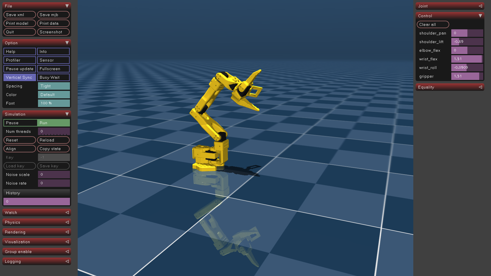

# robot-quant
This dissertation investigates whether the throughput–accuracy trade-off observed in NPU-deployed frame classification also applies to closed-loop robotic control, and whether INT8 quantization degrades continuous control more severely than it degrades classification

# running mujoco

```bash
python3 -m venv .venv
source .venv/bin/activate
python3 -m pip install --upgrade pip
pip install -r requirements.txt
python -c "import mujoco; print('MuJoCo:', mujoco.__version__)"
python -m mujoco.viewer --mjcf=assets/robotstudio_so101/scene.xml
```


